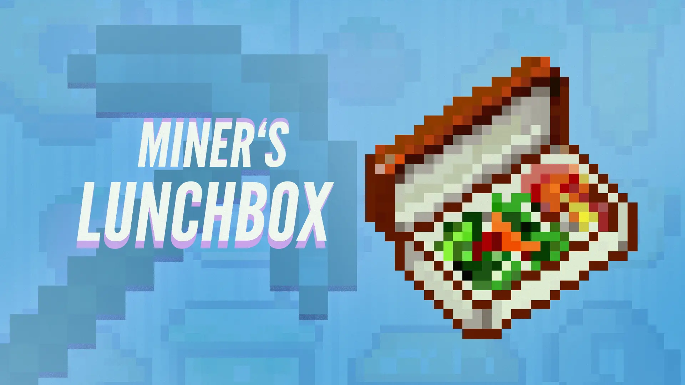

# Miner's Lunchbox

A tiny Fabric mod that adds a single item - Lunchbox.

You may have heard of it in the good old days like the one in the Spice of Life mod. However, the lunchbox here acts more similarly to the bundles in the game and can store up to 128 pieces of food.

When eaten, it will randomly select one item stored in it and lets the user consume it.
